# Replicating existing interactions

*Markdown reference: https://makecode.microbit.org/projects/plant-watering*

## Instructions ##

*It's a design that uses micro bit humidity sensors for automatic watering. When the humidity dropped below a predetermined value, servo turned the machine's shaft to water it.

### Plant watering ###

#### Photo of completed project ####

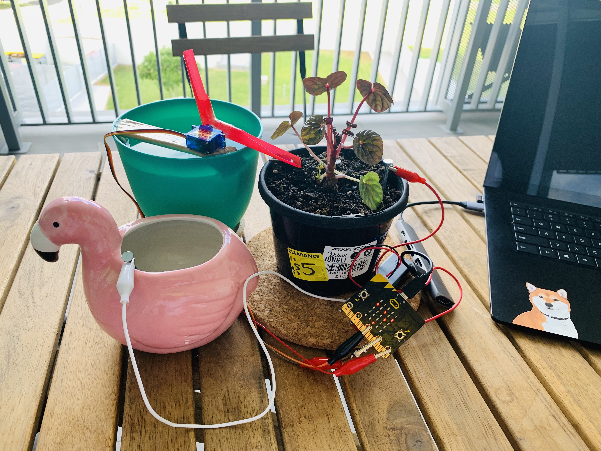

#### Reflection ####

In this experiment, something new to me was or something I learned was (insert something here).

This experiment could be the basis of a real world application such as (insert something here).

### Part 1 Preparation  ###

Watch the video to get an idea of how the restoration project will work.

Link: https://makecode.microbit.org/projects/plant-watering

Original Project Code Diagram
Link: https://makecode.microbit.org/projects/plant-watering/code

After watching the video, I began to think about how the original design was designed and made.

PS: I think the design and logic is the focus of my restoration project.

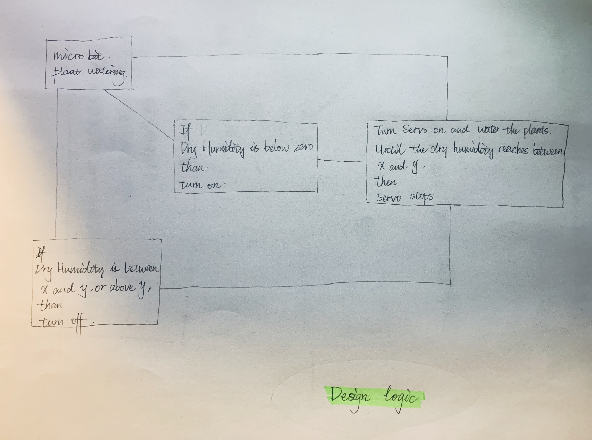

（Try to recover the design logic）

#### Part 2 Device making ####
Material preparation

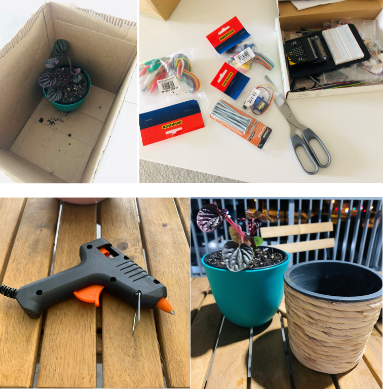

(BUY FROM JAYCAR! Thanks to Angle for sharing this information, you can go to Jaycar and get the parts you need.)

Due to the lack of some materials such as flexible Straw, so I had to find a solution.
Although the appearance is a bit uncomfortable and beautiful, but at least it can ensure that it can work properly. Once the material is ready, the next phase begins

#### Production Phase ####

This stage consists of two parts: Coding and device fabrication.

Code writing

Numerical reference based on the original code. But in the next stage of making the device, the details of the actual situation will be adjusted. (for example, the value of the rotation angle of the mechanical shaft, etc. .)

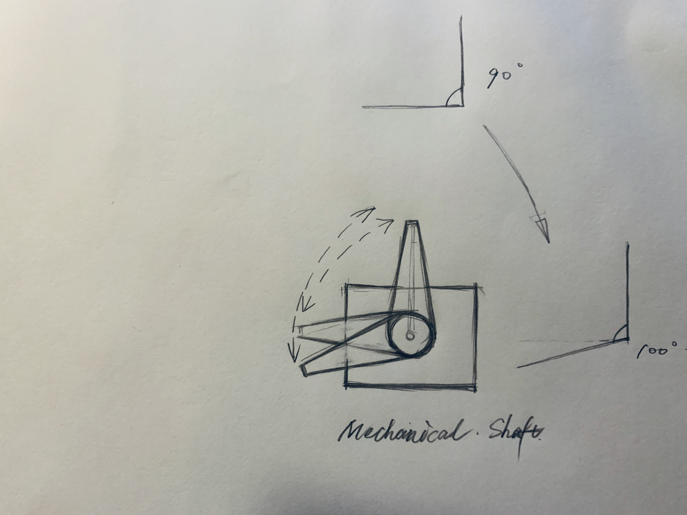

The rotation angle value of the mechanical shaft is adjusted to make the water out of the straw more quickly.

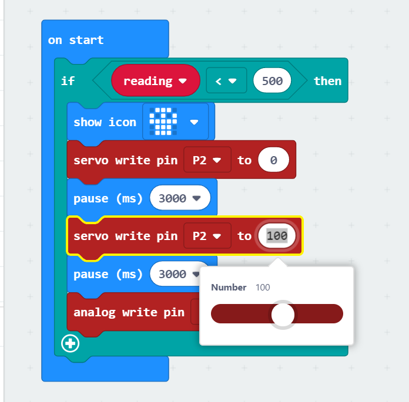

(The code for the watering part)

Dry Humidity Code

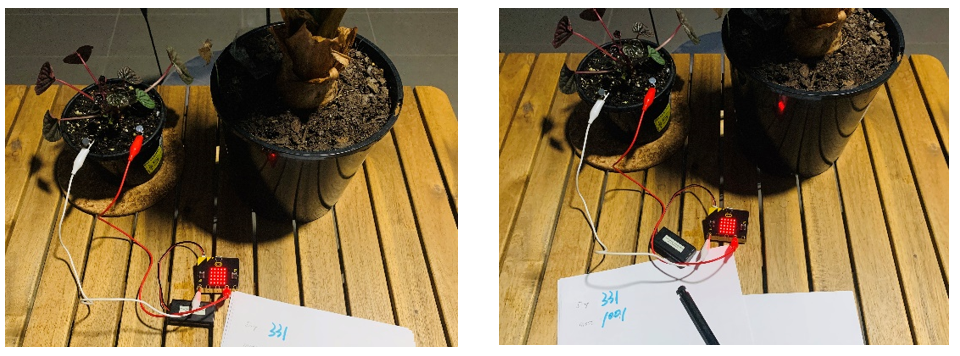

Check for dry humidity (Dry: 331  most: 1001)

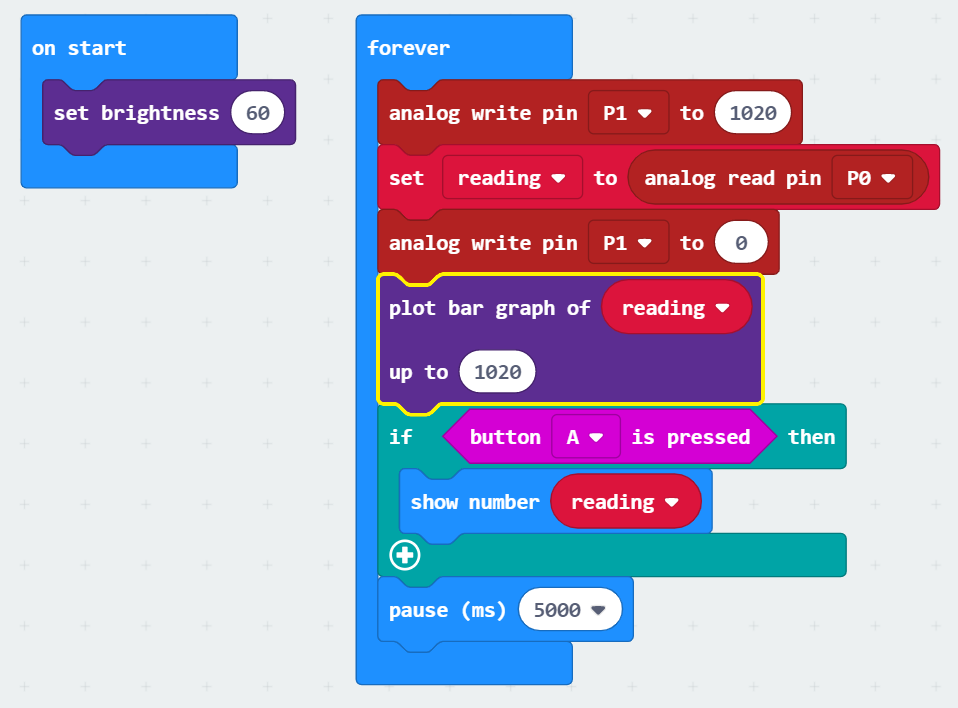

Optimizes the consumption of dry moisture after the final code.

Final Code for plant watering project. (Code writing & Dry Humidity Code)

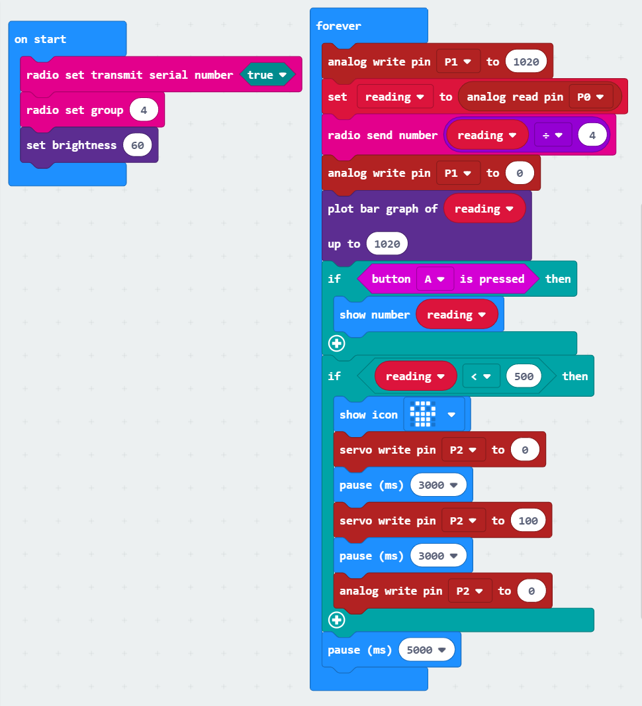

## Production process ##

### Experiment made 1 ###

A total of three times to make the device. The first time is mainly to understand the structure of the device, also made a draft model.

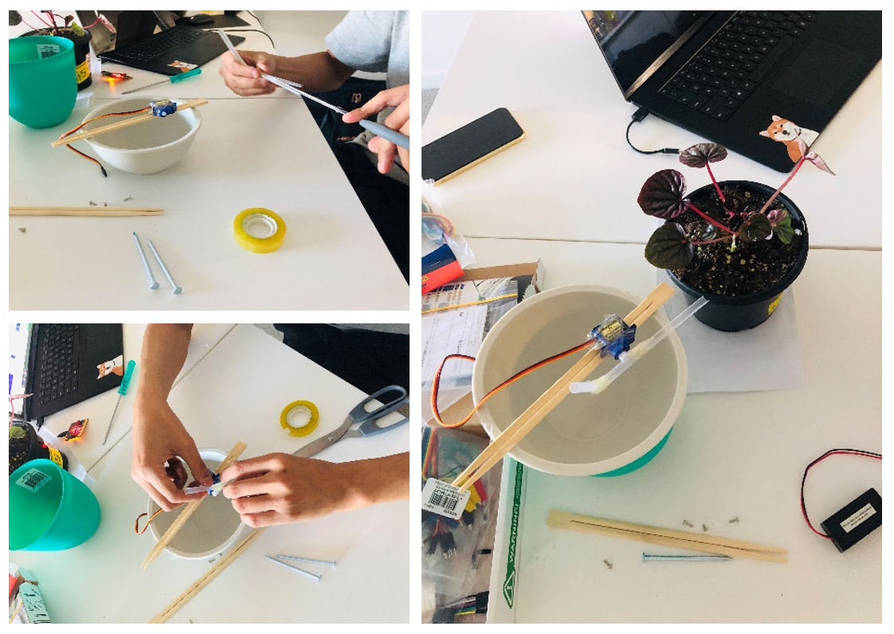

### Experiment made 2 ###

The second production failed and there were technical problems.

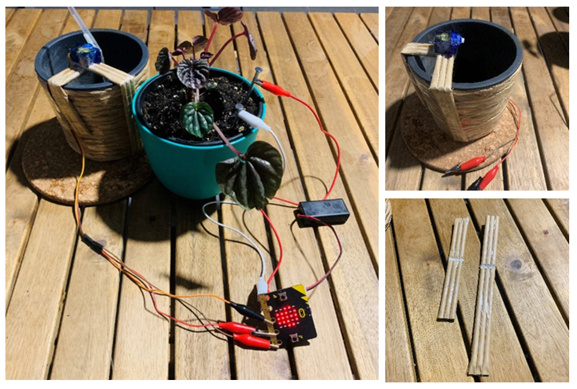

The main problem is to focus on aesthetics, ignoring the machine axis from the bowl change distance. The distance between them is too great. The Rear Pipette doesn't have enough distance to carry the water.

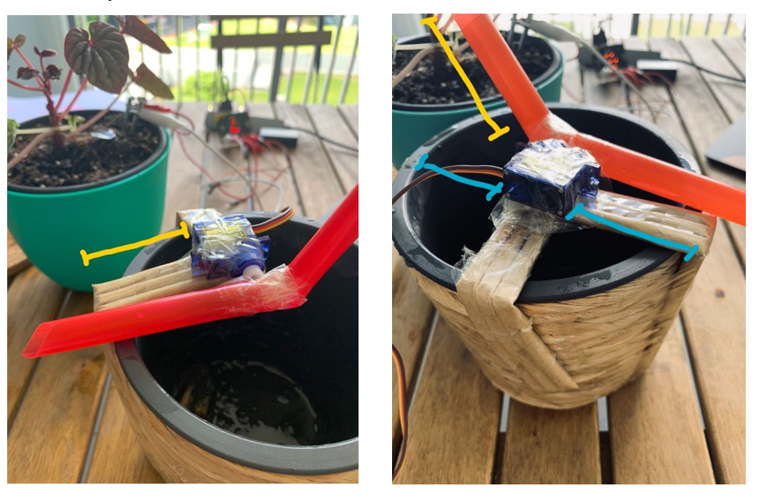

(Yellow and blue lines)

### Experiment made 3 ###

Third Production. From the experience of the first two. Pay More attention to the structural details of the device. Make sure all the parts are working properly. And improve the aesthetics of the device as much as possible.

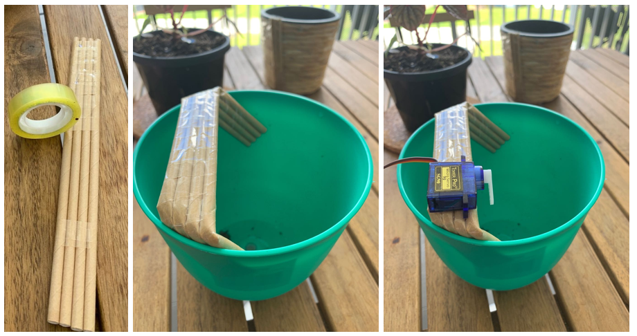

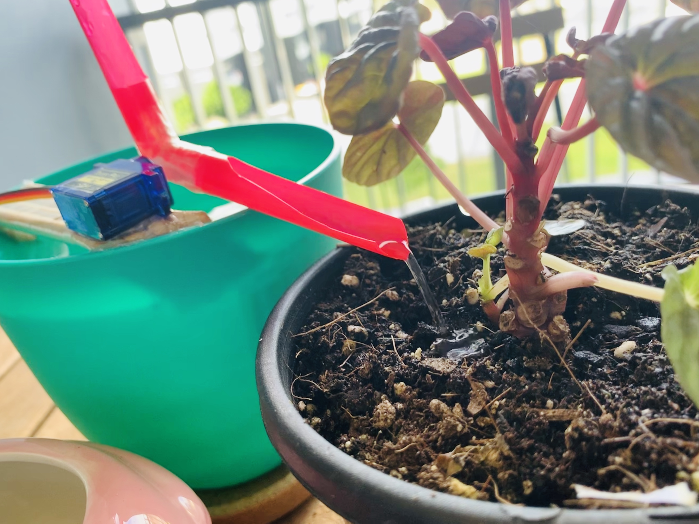

In the process I found that different sizes of straws have an effect on the amount of water produced, so I made two straws of different sizes and colors, which can be changed at will, adding a bit of fun. Just like people change their clothes.

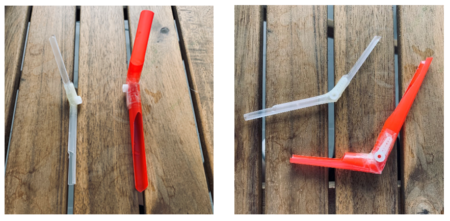

My experience with the plant watering project：
There are two main aspects of the production that I find challenging. One is to install wiring (line positive and negative) , the other is to adjust the code value.
Maybe it was the first time I touched the circuit board and the code, so I spent a lot of time in the production process to modify. But it should be relatively easy for someone with the foundation and experience. 

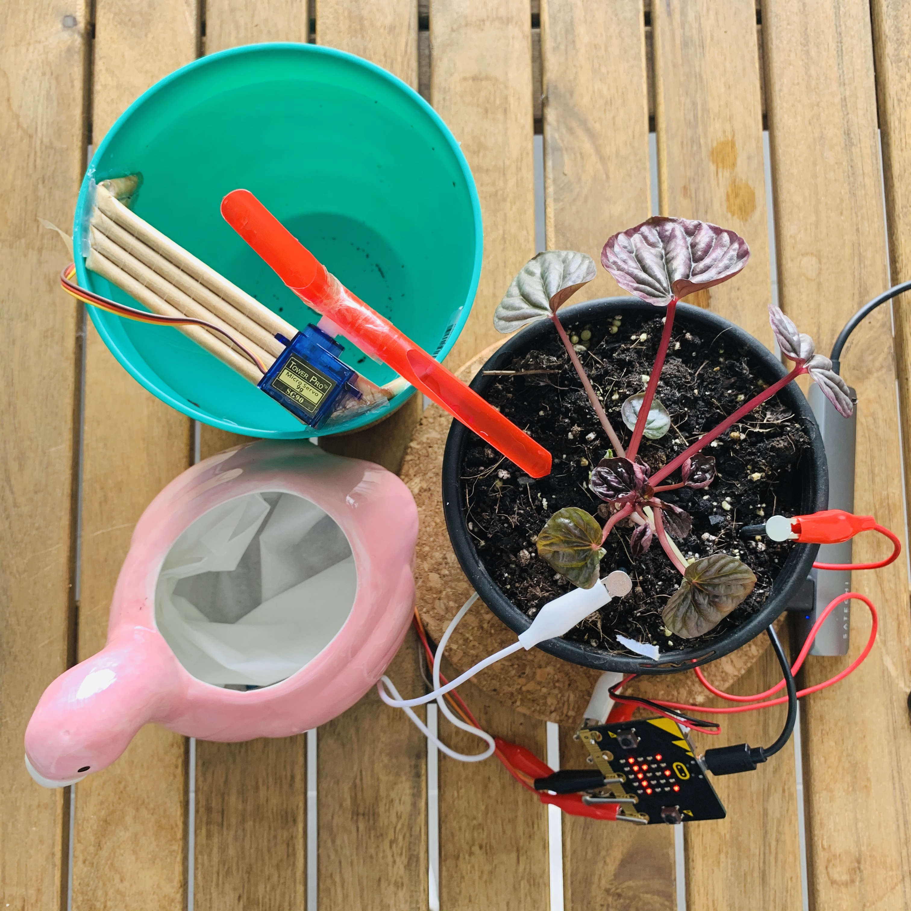

# Thank you for reading #

